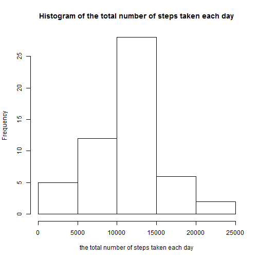
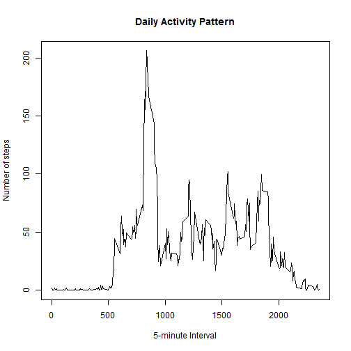
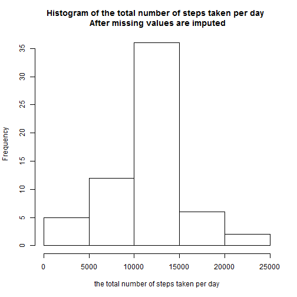
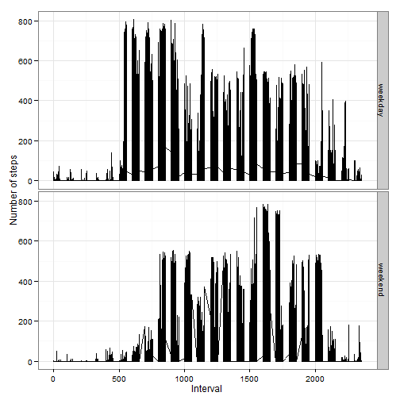

# Reproducible Research: Peer Assessment 1


## Loading and preprocessing the data

* Load the data

```r
ac <- read.csv("activity.csv")
```


* Process/transform the data (if necessary) into a format suitable for your analysis

```r
# transform the date into date format
ac[, 2] <- as.Date(ac[, 2])
```


## What is mean total number of steps taken per day?

* Make a histogram of the total number of steps taken each day

```r
# total number of steps taken per day
ttlstepspd <- aggregate(steps ~ date, ac, sum, na.action = na.omit)

# mean of total number of steps taken per day
meansteps <- mean(ttlstepspd[, 2])
mediansteps <- median(ttlstepspd[, 2])

hist(ttlstepspd[, 2], main = "Histogram of the total number of steps taken each day", 
    xlab = "the total number of steps taken each day")
```

 


* Calculate and report the mean and median total number of steps taken per day
The mean total number of steps taken each day is 1.0766 &times; 10<sup>4</sup>.
The median total number of steps taken each day is 10765.


## What is the average daily activity pattern?

* Make a time series plot (i.e. type = "l") of the 5-minute interval (x-axis) and the average number of steps taken, averaged across all days (y-axis)


```r
# Average number of steps taken for each interval
avestepsperitvl <- aggregate(steps ~ interval, ac, mean, na.action = na.omit)

plot(avestepsperitvl[, 2] ~ avestepsperitvl[, 1], type = "l", main = "Daily Activity Pattern", 
    xlab = "5-minute Interval", ylab = "Number of steps")
```

 


* Which 5-minute interval, on average across all the days in the dataset, contains the maximum number of steps?

The 835 5-minute interval contains the maximum number of steps (206.1698).


## Imputing missing values

* Calculate and report the total number of missing values in the dataset (i.e. the total number of rows with NAs)

```r

# the total number of rows with NAs
nrow.na <- nrow(ac) - nrow(na.omit(ac))
nrow.na2 <- sum(is.na(ac))
```

The total number of missing values in the dataset is 2304

* Strategy for filling in all of the missing values: using the mean steps taken per day or the mean steps taken for that 5-minute interval, depending on whichever one is available.
* Create a new dataset that is equal to the original dataset but with the missing data filled in.

### Steps for filling in Missing Values
1. Make sure there is no NA in Dates and intervals
2. Prepare data to be used as substitues for missing values
3. Create a new dataframe to fill in missing data
4. Filling: Fill in missing value with either number of steps taken each day or number of steps taken each interval, depending on whichever one is available.


```r
#1 Make sure there is no NA in Dates and intervals
sum(is.na(ac$date))
```

```
## [1] 0
```

```r
sum(is.na(ac$interval))
```

```
## [1] 0
```

```r

#2 Data used as substitutes for missing values
#Average steps taken for each day
avestepspd <- aggregate(steps ~ date, ac, mean, na.action = na.omit)
#Average steps taken for each interval

#3 Create a new dataframe (ac2) to fill in missing data
ac2 <- ac 

#4 Filling in missing values
rowindex.na <- which(is.na(ac[,1]))

for (i in 1:length(rowindex.na)){
  #using average per interval if available
  if (ac2[rowindex.na[i],3] %in% avestepsperitvl[,1]) {
    ac2[rowindex.na[i], 1] <- 
      avestepsperitvl[avestepsperitvl[,1] == ac2[rowindex.na[i],3],2]
  } 
  # using average per day if available
  else if (ac2[rowindex.na[i],2] %in% avestepspd[,1]) {  
    ac2[rowindex.na[i], 1] <-  
      avestepspd[avestepspd[,1] == ac2[rowindex.na[i],3],2]
  }  
}
```


* Make a histogram of the total number of steps taken each day and Calculate and report the mean and median total number of steps taken per day. 

```r
# total number of steps taken per day
ttlstepspd2 <- aggregate(steps ~ date, ac2, sum)

# mean of total number of steps taken per day
meansteps2 <- mean(ttlstepspd2[, 2])
mediansteps2 <- median(ttlstepspd2[, 2])

hist(ttlstepspd2[, 2], main = "Histogram of the total number of steps taken per day \n After missing values are imputed", 
    xlab = "the total number of steps taken per day")
```

 


After missing values are filled in, the mean total number of steps taken per day is 1.0766 &times; 10<sup>4</sup>.
After missing values are filled in, the median total number of steps taken per day is 1.0766 &times; 10<sup>4</sup>.


* Do these values differ from the estimates from the first part of the assignment?

```r
t.test(ttlstepspd[, 2], ttlstepspd2[, 2])
```

```
## 
## 	Welch Two Sample t-test
## 
## data:  ttlstepspd[, 2] and ttlstepspd2[, 2]
## t = 0, df = 107.1, p-value = 1
## alternative hypothesis: true difference in means is not equal to 0
## 95 percent confidence interval:
##  -1539  1539
## sample estimates:
## mean of x mean of y 
##     10766     10766
```


It does not differ from the estimates from the first part of the assignment. Imputing missing data allows total daily number of steps calculated for all days.


## Are there differences in activity patterns between weekdays and weekends?

* Create a new factor variable in the dataset with two levels – “weekday” and “weekend” indicating whether a given date is a weekday or weekend day.

```r
ac2$Day <- weekdays(ac2[, 2])

ac2[, 4][ac2[, 4] %in% unique(ac2[, 4])[1:5]] <- "weekday"
ac2[, 4][ac2[, 4] == "Saturday"] <- "weekend"
ac2[, 4][ac2[, 4] == "Sunday"] <- "weekend"
ac2[, 4] <- as.factor(ac2[, 4])
# The new factor variable (Day) indicating whether a given date is a weedday
# or weekend day.
class(ac2$Day)
```

```
## [1] "factor"
```

```r
levels(ac2$Day)
```

```
## [1] "weekday" "weekend"
```


To compare weekdays and weekends steps pattern, the average steps take for each interval in weekdays and weekends were calculated respectively. 

```r
# Average number of steps taken for each interval for all weekday days or
# weekend days respectively
avestepsperitvl2 <- aggregate(steps ~ interval + Day, ac2, mean)

# Linear regression is used to compare the activity pattern between weekends
# and weekdays.
a <- lm(steps ~ interval + Day + interval:Day, ac2)
summary(a)
```

```
## 
## Call:
## lm(formula = steps ~ interval + Day + interval:Day, data = ac2)
## 
## Residuals:
##    Min     1Q Median     3Q    Max 
##  -63.0  -36.6  -33.2  -11.4  772.0 
## 
## Coefficients:
##                      Estimate Std. Error t value Pr(>|t|)    
## (Intercept)          32.32022    1.82120   17.75  < 2e-16 ***
## interval              0.00279    0.00133    2.10    0.036 *  
## Dayweekend          -10.54669    3.55600   -2.97    0.003 ** 
## interval:Dayweekend   0.01469    0.00260    5.64  1.7e-08 ***
## ---
## Signif. codes:  0 '***' 0.001 '**' 0.01 '*' 0.05 '.' 0.1 ' ' 1
## 
## Residual standard error: 105 on 17564 degrees of freedom
## Multiple R-squared:  0.00451,	Adjusted R-squared:  0.00434 
## F-statistic: 26.5 on 3 and 17564 DF,  p-value: <2e-16
```

In general, there are less steps taken during weekends, but it also depend on days. Before 1500, there are less steps taken during weekends, but between 1500 to 2000, there are more steps taken during weekends.


* Make a panel plot containing a time series plot (i.e. type = "l") of the 5-minute interval (x-axis) and the average number of steps taken, averaged across all weekday days or weekend days (y-axis)


```r

library(ggplot2)
ggplot(data = ac2, aes(x = interval, y = steps, group = Day)) + geom_line() + 
    facet_grid(Day ~ .) + theme_bw() + ylab("Number of steps") + xlab("Interval")
```

 

